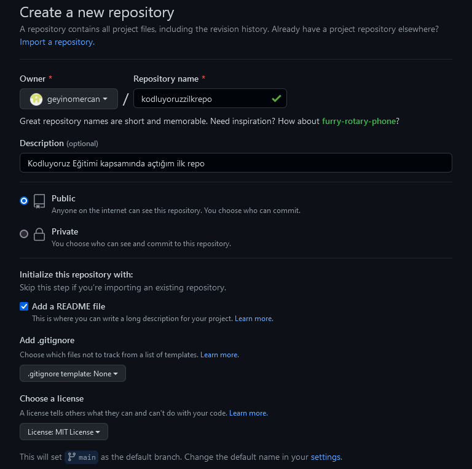

# Kodluyoruz İlk Repo
---
Bu repo [Kodluyoruz](https://github.com/geyinomercan/kodluyoruzilkrepo.git) Front-End Eğitiminde ilk repo. İçerisinide bir ader README dosyası, bir adet de index.html barındırıyor.



# Installation
---
Öncelikle projeyi clonelayın.(Buraya sizin reponuzdan aldığınız link gelecek)

```
    https://github.com/geyinomercan/kodluyoruzilkrepo.git
```

# Usage
---
Projeyi cloneladıktan sonra Visual Studio Code programını açınız.

Linux için:
```
    cd kodluyoruzilkrepo
    code .
```

# Contributing
---
Pull requestler kabul edilir. Büyük değişiklikler için, lütfen önce neyi değiştirmek istediğiniz tartışmak için bir konu açınız.

# License
---
[MIT](https://choosealicense.com/licenses/mit/)